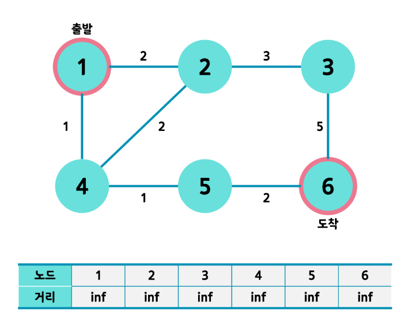
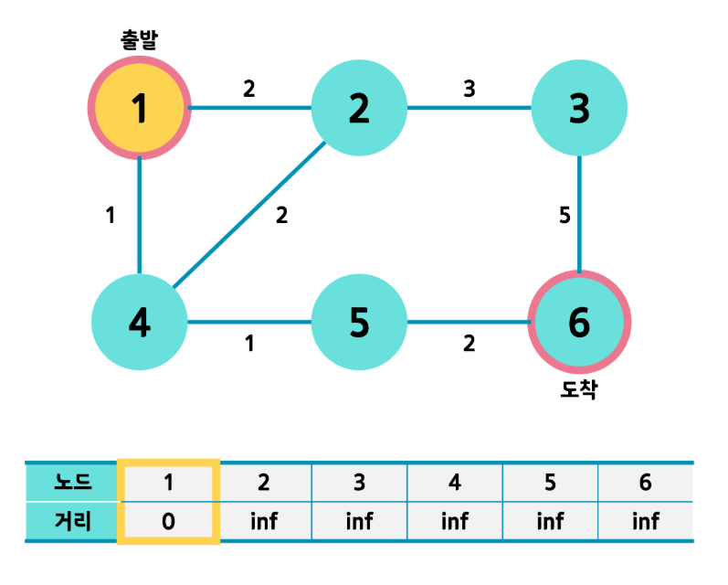
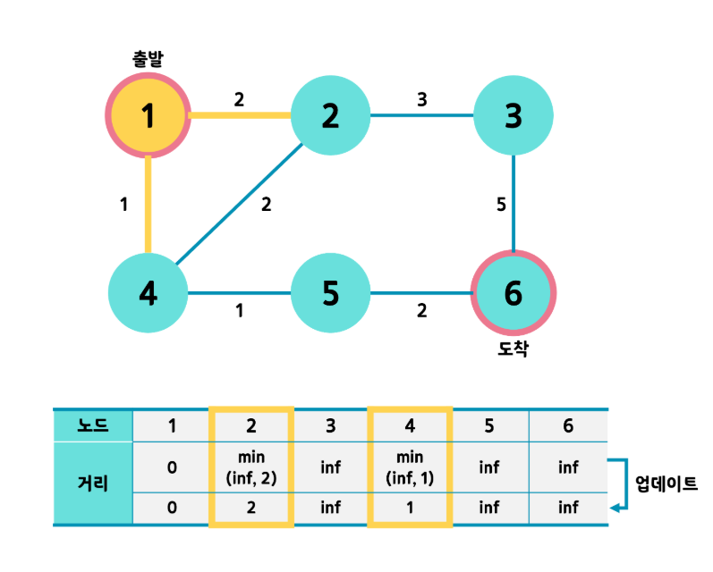
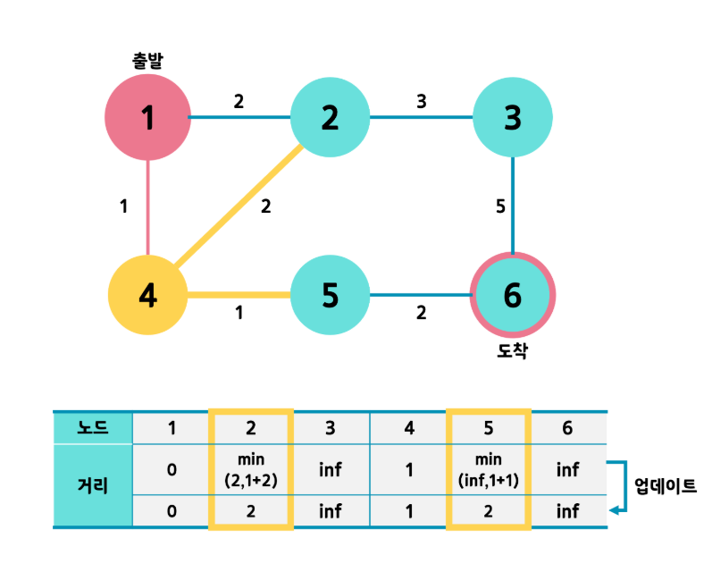
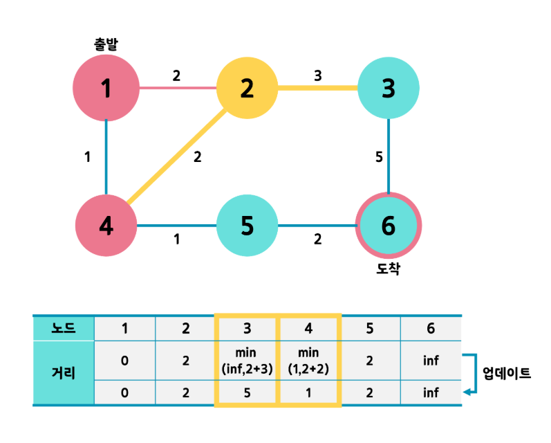
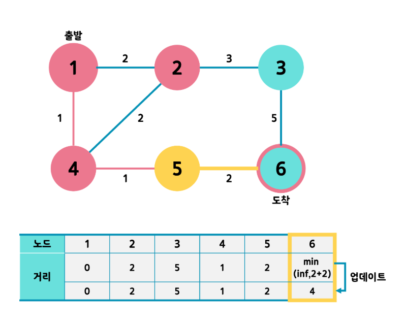
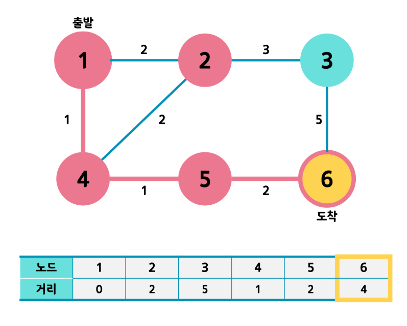

## Dijkstra 알고리즘이란?
<callout color="gray_bg">
	>
		**Dijkstra 알고리즘은 그래프에서 한 정점(노드)에서 다른 정점까지의 최단 경로를 구하는 알고리즘 중 하나이다.**
	- 위 과정에서 도착 정점 뿐만 아니라 모든 다른 정점까지 최단 경로로 방문하며 각 정점까지의 최단 경로를 모두 찾게 된다.
</callout>
<empty-block/>
## 동작 단계
<callout color="gray_bg">
	>
		1. 출반 노드와 도착 노드를 설정한다.
		2. 최단 거리 테이블을 초기화한다.
		3. 현재 위치한 노드의 인접 노드 중 방문하지 않은 노드를 구별하고, 방문하지 않은 노드 중 거리가 가장 짧은 노드를 선택한 뒤 해당 노드를 방문 처리한다.
		4. 해당 노드를 거쳐 다른 노드로 넘어가는 가중치를 계산해 최단 거리 테이블을 업데이트 한다.
		5. 3\~4의 과정을 반복한다.
	<br>- 최단 거리 테이블은 1차원 배열로, N개 노드까지 오는 데 필요한 최단 거리를 기록한다. N개 크기의 배열을 선언하고 큰 값을 넣어 초기화시킨다.
	- 노드 방문 여부 체크 배열은 방문한 노드인지 아닌지 기록하기 위한 배열로, 크기는 최단 거리 테이블과 같다. 기본적으로는 False로 초기화하여 방문하지 않았음을 명시한다.
</callout>

- 출발 노드는 1번, 도착 노드는 6번이라고 가정하여 거리 테입르을 전부 inf로 초기화. 각 노드들을 잇는 간선의 가중치 표시.

- 출발 노드를 먼저 선택하고 거리를 0으로 한다.

- 시작 노드(1번 노드)와 인접한 노드들의 가는 거리를 각각 기존의 거리값과 비교해 최솟값으로 업데이트 후 해당 노드를 방문 처리한다. 
- 위의 예시 같은 경우에는 4 노드로 이동한다.

- 방금전과 같은 작업을 이번에 이동한 노드에서 다시 수행한다. 다음 노드를 선택되는 과정에서 아직 방문하지 않은 노드들의 가중치가 같을 경우 가장 작은 인덱스로 이동한다.
- 이때 2 노드는 기존에 업데이트를 진행해서 2로 수정되어 있는데, 만약 1에서 2 노드로 이동하는 것보다 1에서 4를 통해 2 노드로 가는 것이 빠를 시 그 경우로 업데이트 된다.

- 위의 과정을 반복한다.

- 위의 과정을 반복한다.

- 최종적으로 1번 노드에서 6번 노드까지 가는 경로는 1 - 4 - 5 - 6 이고, 최소 거리는 4가 된다.
## 특징
<callout color="gray_bg">
	- 위 동작 예시에서 볼 수 있듯 다익스트라 알고리즘은 방문하지 않은 노드 중 최단 거리인 노드를 선택하는 과정을 반복한다.
	- 각 단계마다 탐색 노드로 한 번 선택된 노드는 최단 거리를 갱신하고, 그 뒤에는 더 작은 값으로 다시 갱신되지 않는다.
	- 도착 노드는 해당 노드를 거쳐 다른 노드로 가는 길을 찾을 필요는 없다.
	- 다익스트라 알고리즘은 가중치가 양수일 때만 사용 가능하다는 중요한 특징이 있다.
</callout>
## 구현 방법
```python
# 우선순위 큐

import heapq
import sys

input = sys.stdin.readline
v, e = map(int, input().split())
s = int(input())
INF = 9999999
dist = [INF] * (v+1) # 시작노드에서부터 v로 가는 최소 비용
graph = [[] for _ in range(v+1)] # [v1에서][v2, v2로 가는 비용]

for _ in range(e) :
    v1, v2, cost = map(int, input().split())
    graph[v1].append((v2, cost))

def dijkstra(start) :
    q = []
    heapq.heappush(q, (0, start))
    dist[start] = 0
    
    while q :
        distance, node = heapq.heappop(q)
        if distance > dist[node] :
            continue
        
        for n in graph[node] :
            new_cost = n[1] + dist[node] # v2로 가는 노드의 거리 + 내가 방금 빼낸 관심노드까지의 최단거리
            if new_cost < dist[n[0]] : # v2까지의 거리보다 짧으면
                dist[n[0]] = new_cost
                heapq.heappush(q, (new_cost, n[0]))
    

dijkstra(s)

for i in range(1, v+1) :
    if dist[i] == INF :
        print("INF")
    else :
        print(dist[i])
```
