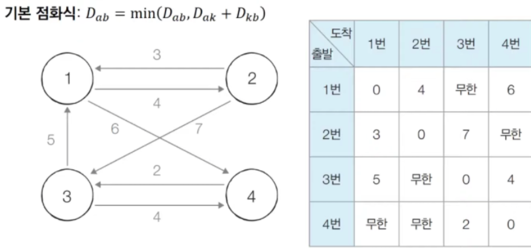
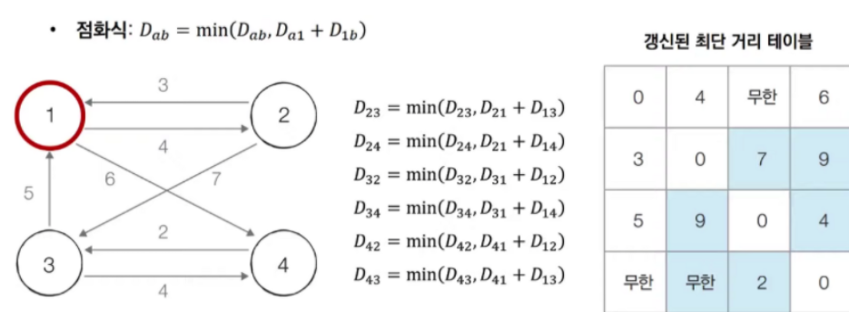
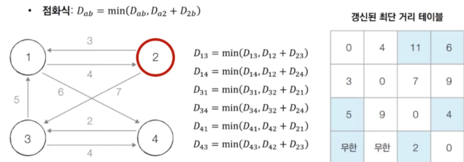

> 정식 명칭은 **플로이드 워셜 알고리즘(Floyd-Warshall Algorithm)**이지만, 여기서는 줄여서 
> **플로이드 알고리즘**이라고 말하겠다.

> > **모든 지점에서 다른 모든 지점까지의 최단 경로를 모두 구하려면 어떻게 해야될까?**
> → 플로이드 알고리즘을 사용한다. 
> <br>- 플로이드 알고리즘은 단계마다 **거쳐가는 노드**를 기준으로 알고리즘을 수행한다. 
> 하지만, 매 단계마다 방문하지 않은 노드 중에서 최단 거리를 갖는 노드를 찾을 필요가 없다.
> <br>- 플로이드 알고리즘은 DP 알고리즘에 속한다. 
> - 왜나하면, 만약 노드의 개수가 N개 라면, N번 만큼 단계를 반복하며 점화식에 맞게 2차원 리스트를 갱신하기 때문에 DP라고 볼 수 있다.

> **플로이드 알고리즘의 점화식**
	---
	$$
	D_{ab} = \min(D_{ab'}D_{ak} + D_{kb})
	$$

## 플로이드 알고리즘 예시
---
**\[step 0\]** 그래프의 노드와 간선에 따라 최단 거리 테이블을 갱신한다.



**\[step 1\]** 1번 노드를 거쳐 가는 경우를 고려하여 테이블을 갱신한다.



**\[step2\]** 2번 노드를 거쳐 가는 경우를 고려하여 테이블을 갱신한다.



**\[step …\]** 위 작업을 계속 반복한다.

## 플로이드 알고리즘 코드
---
```python
import sys

input = sys.stdin.readline
INF = int(1e9)

# 노드의 개수(n)과 간선의 개수(m) 입력
n = int(input())
m = int(input())

# 2차원 리스트 (그래프 표현) 만들고, 무한대로 초기화
graph = [[INF] * (n + 1) for _ in range(n + 1)]

# 자기 자신에서 자기 자신으로 가는 비용은 0으로 초기화
for a in range(1, n + 1):
    for b in range(1, n + 1):
        if a == b:
            graph[a][b] = 0

# 각 간선에 대한 정보를 입력받아, 그 값으로 초기화
for _ in range(m):
    # A -> B로 가는 비용을 C라고 설정
    a, b, c = map(int, input().split())
    graph[a][b] = c

# 점화식에 따라 플로이드 워셜 알고리즘을 수행
for k in range(1, n + 1):
    for a in range(1, n + 1):
        for b in range(1, n + 1):
            graph[a][b] = min(graph[a][b], graph[a][k] + graph[k][b])

# 수행된 결과를 출력
for a in range(1, n + 1):
    for b in range(1, n + 1):
        if graph[a][b] == INF:
            print('INFINITY', end=' ')
        else:
            print(graph[a][b], end=' ')
    print()

# sample input
# 4
# 7
# 1 2 4
# 1 4 6
# 2 1 3
# 2 3 7
# 3 1 5
# 3 4 4
# 4 3 2
```
> - 시간 복잡도는 `O(N^3)`
> - 노드의 개수가 N개일 때, N번의 단계를 수행하며, 단계마다 `O(N^2)` 의 연산을 통해 현재 노드를      거쳐 가는 모든 경로를 고려한다.
