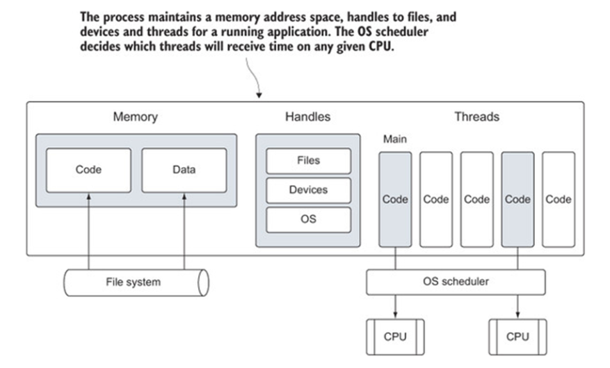
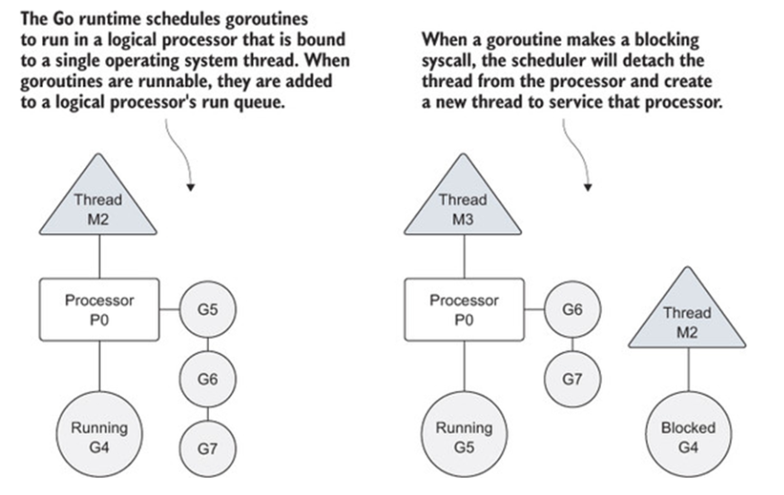
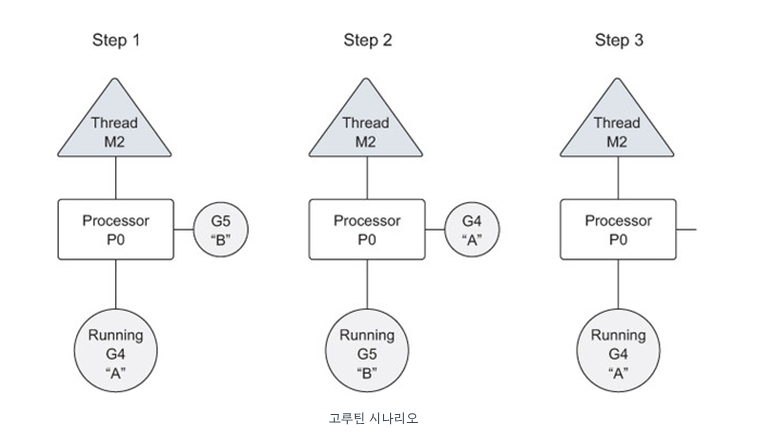

# Goroutine이란?
> Goroutine이란 Go에서 동시성을 관리할 때 사용하는 것이다.<br>이는 C#과 Kotlin에 있는 Coroutine처럼 다른 언어에서도 볼 수 있다.
# 고루틴 논리 프로세서
> Go 표준 라이브러리의 runtinme 패키지에는 GOMAXPROCS를 통해 스케줄러가 사용할 논리 프로세서 수를 지정할 수 있다.
```go
// example
import "runtime"

// 사용 가능한 모든 코어에 대해 논리적 프로세서를 할당.
runtime.GOMAXPROCS(runtimeNumCPU())
```
# Go에서 동시성 관리

> 운영 체제는 스레드가 물리적 프로세서에 대해 실행되도록 예약하고 Go 런타임은 고루틴이 논리적 프로세서에 대해 실행되도록 예약합니다.
> 각 논리적 프로세서는 개별적으로 단일 운영 체제 스레드에 바인딩된다.<br>(버전 1.5부터는 기본적으로 사용 가능한 모든 물리적 프로세서에 논리적 프로세서를 할당함.)
> 논리적 프로세서는 생성된 모든 고루틴을 실행하는 데 사용된다,
> 단일 논리적 프로세서가 있어도 수십만 개의 고루틴을 빠른 성능으로 동시에 실행되도록 예약할 수 있다.
#### **+ 더 알아보기**

> 고루틴이 생성되어 실행될 준비가 되면 스케줄러의 글로벌 실행 큐에 배치된다.
> 얼마 지나지 않아 논리적 프로세서에 할당되고 해당 논리적 프로세서의 로컬 실행 큐에 배치된다.
> 로컬 실행 큐에서 고루틴은 실행을 위해 논리적 프로세서가 제공될 차례를 기다린다.
> blocking을 일으키는 syscall이 일어날 경우 스레드와 고루틴은 논리적 프로세서에서 분리되고 syscall에서 반환될 때까지 계속 차단된다.
> 그리고 스케줄러는 새 스레드를 생성하여 논리적 프로세서에 연결한다.
> 그런 다음 스케줄러는 실행을 위해 로컬 실행 대기열에서 다른 고루틴을 선택한다.
> syscall이 반환되면 고루틴은 로컬 실행 대기열로 다시 배치되고 스레드는 나중에 사용할 수 있도록 따로 보관된다.
# 고루틴이 네트워크 I/O 호출을 해야 하는 경우 프로세스
> 고루틴이 논리적 프로세서에서 분리되어 런타임 통합 네트워크 플러로 이동.
> 플러가 읽기 또는 쓰기 작업이 준비되었음을 나타내면 고루틴은 작업을 처리하기 위해 논리적 프로세서에 다시 할당됨.
> 생성할 수 있는 논리적 프로세서 수에 대한 제한은 스케줄러에 내장되어 있지 않음.
> 런타임은 기본적으로 각 프로그램의 스레드 수를 최대 10,000개로 제한된다. 이 값은 패키지 SetMaxThreads에서 함수를 호출하여 변경할 수 있다.
# 고루틴 동작 과정 

> step1에서 스케줄러는 고루틴 B가 실행 큐에서 차례를 기다리는 동안 고루틴 A를 실행하기 시작.
> step2에서 스케줄러는 갑자기 고루틴 A를 고루틴 B로 바꾼다. 고루틴 A가 완료되지 않았으므로 실행 큐에 다시 배치됨.
> step3에서 고루틴 B가 작업을 완료하고 사라진다. 이를 통해 고루틴 A가 다시 작업을 시작할 수 있다.
> 물론 처음에 실행한 고루틴 A가 빠르게 수행될 수 있다면 고루틴이 교체되는 것을 보지 못할 수도 있다. 여기서 **중요한 점은 goroutine은 여타 스레드처럼 사용자가 관여하지 않아도 알아서 교체가 되어 다른 것이 실행될 수 있다는 점이다.**
