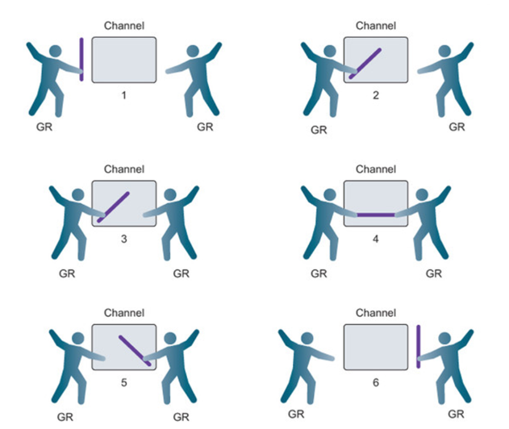
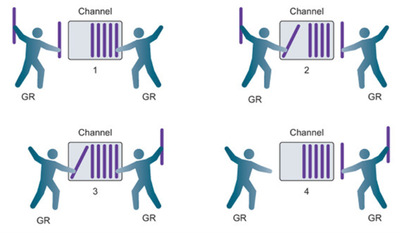

# Race Condition 감지
> >
> **경쟁 상태 감지 도구** - `go build -race`
> Go에는 코드에서 경쟁 조건을 감지할 수 있는 특수 도구가 존재한다.
> `go build`시 `-race` 를 붙이면 어떤 고루팀이 경쟁 상태를 만드는지 보여준다. (하지만 일반적인 프로그램인 경우 메모리 사용량이 5\~10배, 실행 시간은 2\~20배 증가한다. 즉 테스트에만 사용해라)
> > **원자 함수**
> 원자 함수는 정수나 포인터에 대한 액세스를 동기화하기 위한 저수준 잠금 매커니즘을 제공한다.
> ```go
atomic.AddInt64(&counter, 1)
		```
> > **뮤텍스 (Mutex)**
> OS에 있는 뮤텍스와 차이없다. Lock과 UnLock으로 임계 구역 진입을 통제한다.
> ```go
mutex sync.Mutex
mutex.Lock()
mutex.Unlock()
		```
> > **채널 (Channel)**
> Go가 동시성 프로그램에 특화되어 있다는걸 확인할 수 있는 기능. Channel을 통해 Goroutine간의 리소스 공유를 할 수 있고, 이를 통해 동기화가 가능하다.
> ```go
// 정수의 버퍼링되지 않은 채널
unbuffered := make(chan int)

// 문자열의 버퍼링된 채널
buffered := make(chan string, 10)

// 채널을 통해 문자열을 전송
buffered <- "Gopher"

// 다른 고루틴에서 전송한 값을 받기 위해서 채널에서 문자열을 수신한다.
value := <-buffered
		```
> - 채널에는 두 가지 구문이 있는데, ←와 →이다.
> - 채널에 데이터를 **보내려면** channel ←
> - 채널에서 데이터를 **받으려면** ← channel
> 이렇게 사용할 수 있다.
> 고루틴 안에 생성된 채널은 해당 채널에 데이터가 전달될 때까지 데이터를 받는 채널은 대기하게 된다. 이러한 동시적인 특징으로 인해 채널은 고루틴의 데드락을 방지하며 함수의 흐름을 제어할 수 있다.
> 개발자는 컴퓨터가 아니기 때문에 Mutex 만으로는 완벽하게 코드를 만들 수 없다. (Mutex만으로 Channel처럼 구현은 가능하다)
> 복잡한 Mutex는 메모리 누수를 일으키고, 메모리 누수는 데드락을 일으킨다.
> Mutex가 아닌 채널 중심으로 코딩을 하다보면 Goroutine Leak을 찾기 편해지고, 자원회수를 하기 쉽다. (Go가 Channel을 추천하는 이유)
> 그렇다고 Mutex를 배제하라는게 아니다.
# Channel 예시
```go
package main
import "fmt"

func main() {
	c := make(chan int)
	go func() {
		c<-3
		fmt.Println("test")
	}()
}

/*
    실행 결과 : 
    
*/
```
> 위의 코드는 실행하면 test라는 문구가 콘솔에 찍혀야 하지만 아무것도 나오지 않는데, 그 이유는 채널 데이터를 수신할 때까지 대기 상태가 되었기에 실행이 멈춘 것이다.
	→데이터 수신 부분을 추가하면 위의 코드는 정상이 된다.
```go
package main
import "fmt"

func main() {
	c := make(chan int)
	go func() {
		c<-3
	}()
	
	fmt.Println(<-c)
	fmt.Println(c)
}

/*
    실행 결과 : 
    3
    0xc000080060
*/
```
## Channel의 종류
```go
// 정수의 버퍼링되지 않은 채널
unbuffered := make(chan int)

// 문자열의 버퍼링된 채널
buffered := make(chan string, 10)

// 채널을 통해 문자열을 전송
buffered <- "Gopher"

// 다른 고루틴에서 전송한 값을 받기 위해서 채널에서 문자열을 수신
value := <-buffered
```

### 버퍼링 되지 않은 채널
> 버퍼링 되지 않은 채널은 수신되기 전에 어떤 값도 보관할 수 있는 용량이 없는 채널이다.
> 모든 송신 또는 수신 작업이 완료되기 전에 송신 및 수신 고루틴이 모두 같은 순간에 준비되어야 한다.
> 두 고루틴이 같은 순간에 준비되지 않으면 채널은 해당 송신 또는 수신 작업을 수행하는 고루틴을 먼저 기다리게 된다.

### 버퍼링 된 채널
> 버퍼링된 채널은 수신 되기 전에 하나 이상의 값을 보관할 수 있는 용량이 있는 채널이다.
> 고루틴이 송신 및 수신을 수행하기 위해 동시에 준비되도록 강제하지 않는다.
> 송신 또는 수신이 차단되는 경우에도 다른 조건이 있다.
> - 수신은 채널에 수신할 값이 없는 경우에만 차단된다.
> - 송신은 전송되는 값을 저장할 사용 가능한 버퍼가 없는 경우에만 차단된다.
> 버퍼링되지 않은 채널과 버퍼링된 채널 간의 한 가지 큰 차이점이 생긴다.
> - 버퍼링되지 않은 채널은 송신 및 수신이 발생하는 순간에 두 고루틴 간의 교환이 수행되도록 보장한다.
> - 버퍼링된 채널은 이러한 보장이 없다.
> 버퍼의 크기를 정하게 되면, 해당 채널에 할당된 버퍼의 크기가 넘지 않도록 주의해야 된다. 그렇지 않으면 오류가 발생한다.

### 채널 다중 연산
> 채널을 통해 다중 연산을 하는 경우 이를 손쉽게 사용할 수 있는 select라는 분기문을 사용한다. 이를 통해 원하는 채널에 값이 들어왔을 때만 해당 분기문을 실행하기 때문에 다중 채널을 통한 연산시 동기화 연산으로 확장시킬 수 있다.
```go
package main
 
import (
    f "fmt"
    "time"
)
 
func main() {
 
    f.Println("select")
 
    c1 := make(chan string)
    c2 := make(chan string)
 
    go func() { // 익명함수를 통한 고루틴 생성
        time.Sleep(time.Second * 1) // 1초간 대기
        c1 <- "one" // c1 채널에 string 값 one을 전송 
    }()
 
    go func() {
        time.Sleep(time.Second * 2)
        c2 <- "two"
    }()
 
    for i := 0; i < 2; i++ {
        select { // 해당 select 분기문 안에 있는 채널에 값이 들어왔을 때 case 내용을 실행한다. 
        case msg1 := <-c1:
            f.Println("received", msg1)
        case msg2 := <-c2:
            f.Println("received", msg2)
        }
    }
 
}
```
> **주의**
	select 분기문도 default 케이스를 지정할 수 있으며 case에 지정된 채널에 값이 들어오지 않았을 때 즉시 실행됩니다. 단, default에 적절한 처리를 하지 않으면 CPU 코어를 모두 점유하므로 주의해야 합니다.
