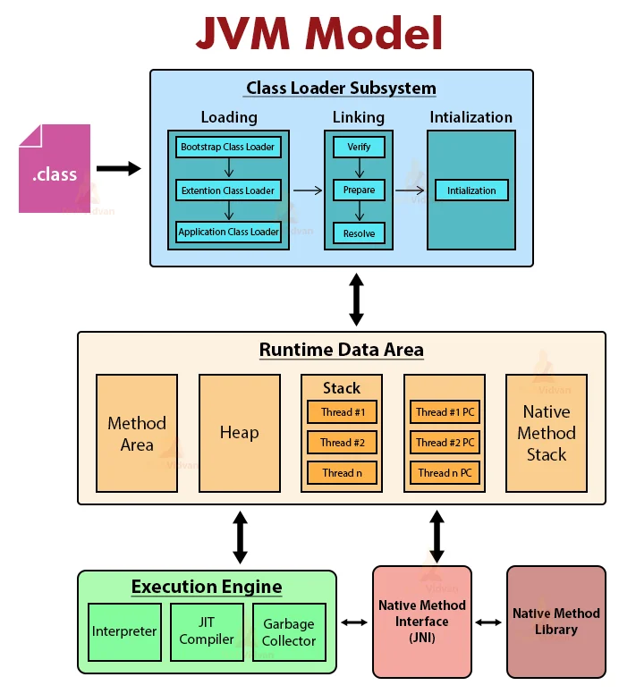

<callout color="gray_bg">
	- **JVM**은 가상머신으로 **Spring boot**는 **JVM **위에서 돌아가는 프레임워크이다.
	<empty-block/>
	- `Spring boot application`을 실행하면, **OS**는 **JVM **프로세스 할당 → 메모리는** 크게 5가지**로 나뉨
</callout>

## Method Area (Metaspace) - 설계도 저장소
---
<callout color="gray_bg">
	- 클래스 레벨의 정보가 저장되는 곳. **Metaspace**라고 불리며, Native Memory(OS 메모리)를 사용
	<empty-block/>
	> **역할**
		**Class Metadata** : 엔티티 등의 클래스 바이트코드(.class)가 로드됨.
		**Library **: 수많은 라이브러리들의 클래스 정보가 로드됨.
		**Static Variables** : `static final` 상수나 정적 변수들이 위치함.
		<empty-block/>
		💡 **중요 포인트** : Spring은 `AOP`를 위해 런타임에 **동적으로 프록시 클래스(CGLIB)를 생성**.
</callout>
## Heap Area - 객체들의 거주지
---
<callout color="gray_bg">
	**- Spring boot**의 심장부. **new **키워드로 생성된 모든 객체와 인스턴스가 존재. 
	`GC`(`Garbage Collection`) 를 통해 객체를 삭제
	<empty-block/>
	> **역할**
		**Spring Bean**
		- `@Controller`, `@Service`, `@Repository`, `@Component`가 붙은 클래스를 **Instance**로 생성
		- **Singleton Bean**은 **Heap **영역의 **Old Generation**에 상주하며 **application 종료까지 유지**
		<empty-block/>
		**Request/Response Dto**
		- **Dto**들은 **Heap**의 **Young Generation**에 생성되었다가, 처리가 끝나면 **GC**에 의해 지워짐.
</callout>
## Stack Area - 스레드의 작업 공간
---
<callout color="gray_bg">
	- 각 **스레드마다 별도로 생성**되는 공간. → 멀티 스레드 사용시 의미 있을 듯.
	<empty-block/>
	- 메서드 **호출의 흐름을 저장.**
	<empty-block/>
	> **역할**
		- 내장 웹 서버는 요청이 들어올 때마다 **스레드 풀에서 스레드 하나를 할당**함. 
		→ 할당된 **스레드는 자신만의 Stack**을 가짐.
		<empty-block/>
		- 호출시 스택 프레임 생성 → 끝날시 스택 프레임 제거(Pop)
		<empty-block/>
		- 메서드 내부에 선언된 **`int`****, ****`long`**` `**기본형 변수**는 이곳에 저장하지만,  `Member member` 객체 변수는 **Heap** 영역의 주소값을 가짐.
</callout>
## PC Register & Native Method Stack
---
<callout color="gray_bg">
	**- PC Register** : **현재 수행 중인 JVM 명령어 주소**를 가리킴.
	<empty-block/>
	**- Native Method Stack** :** ****Java가 아닌 C/C++로 작성된 라이브러리**를 호출 시 사용. 
	→ 성능 최적화나 하드웨어 제어 시 사용
</callout>
