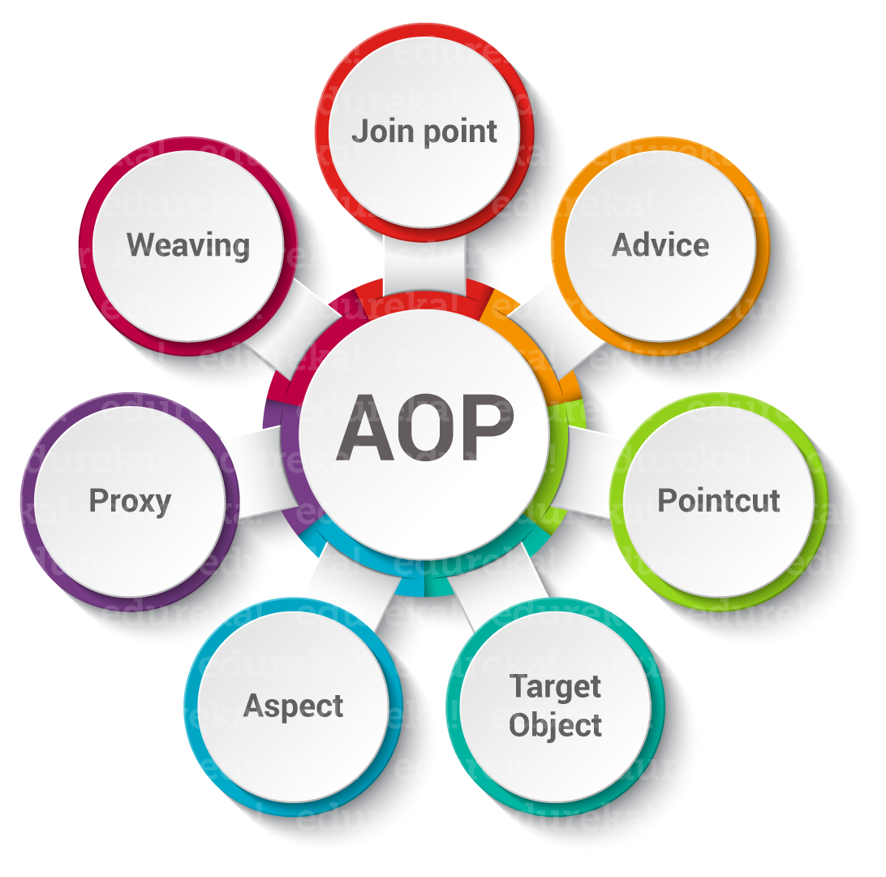

> - 부가 기능을 모듈화하여 주 비즈니스 로직에서 분리하는 **프로그래밍 패러다임.**
- 코드의 **중복성을 제거**하고 **유지 보수성을 높이는 것**이 목적.

## 🌠 자주 사용되는 annotation
---
### `@Aspect`
- 부가 기능을 담고 있는 클래스임을 명시
## **Advice**
---
### `@Before`
- 대상 실행 전에 실행.
### `@AfterReturning`
- 대상 메서드가 정상적으로 반환된 후 실행.
### `@AfterThrowing`
- 대상 메서드에서 예외가 발생했을 때 실행.
### `@After`
- 대상 메서드가 종료된 후 (정상 또는 예외 발생 여부와 관계없이) 실행.
### `@Around`
- 대상 메서드의 실행 전후를 제어. 메서드 실행 자체를 감싸는** 가장 강력한 어드바이스.**

> AOP는 횡단 관심사를 분리하기 위해 Aspect를 만들고, PointCut으로 위치를 정한 뒤, Advice Proxy로 Target에 Weaving햐여 구현한다.
<table header-row="true" header-column="true">
<colgroup>
<col width="175.3333282470703">
<col width="471.3333282470703">
</colgroup>
<tr>
<td>용어</td>
<td>첫 번째 설명의 해당 개념</td>
</tr>
<tr>
<td>Aspect</td>
<td>모듈화된 **부가 기능** 그 자체</td>
</tr>
<tr>
<td>Advice</td>
<td>부가 기능이 **실행될 내용**(@Before, @Around 등)</td>
</tr>
<tr>
<td>Join Point / Pointcut</td>
<td>부가 기능이 **적용될 위치**를 지정하는 매커니즘</td>
</tr>
<tr>
<td>Target / Proxy / Weaving</td>
<td>부가 기능을 비즈니스 로직에 **결합**시키는 Spring의 실제 구현 방식</td>
</tr>
</table>
## ✨ 사용시 좋은 점 및 안 좋은 점
---
### ➕ 좋은 점 (장점)
> **코드 응집도 모듈화 향상**
	**재사용성 증가**
	**유지보수 용이**
### ➖ 안 좋은 점 (단점)
> **복잡성 증가**
	**디비깅의 어려움**
	**AOP 적용 범위 제한**
## 🎆 더 깊은 내용 (Proxy)
---
<embed src="https://sung-98.tistory.com/194"></embed>
