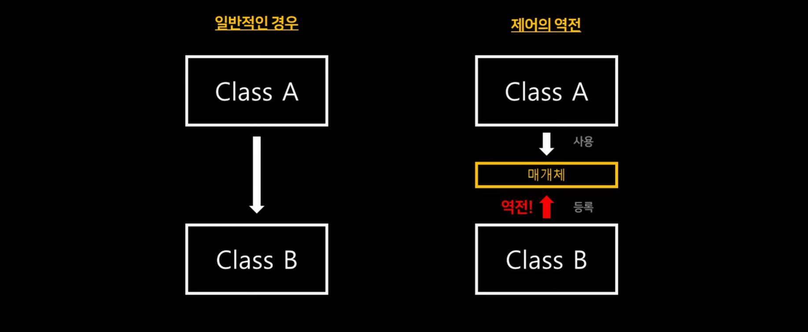

> **- IoC(Invension of Control)** 말 그대로 프로그램의 **제어권이 역전**되었다는 의미.
> **- DI(Dependency Injection)** **IoC를 구현하는 대표적인 방법**.
## 📚 IoC (Invension of Control) 개념
---

> **기존 방식(No IoC) : **개발자가 직접 자신이 사용할 객체를 생성하고 관리함. → **객체 관리를 개발자가 함.**
	**IoC 방식(Spring)** : 프레임워크에 객체의 생성, 관리 권한을 넘김 → **Spring 컨테이너가 애플리케이션의 모든 객체를 관리.**
### ✨ 얻을 수 있는 이점
- 객체 생성 및 관리를 신경쓸 필요가 없어져 핵심 비즈니스 로직에 집중할 수 있음 → **설계 단순화** 📈
- 객체를 프레임워크가 관리하기에 프레임워크의 역할 극대화.
## 📚 DI (Dependency Injection) 개념
> **- 의존성 : A 객체가 B 객체의 기능을 사용하기 위해 B 객체가 필요하다는 것.**
> **- DI**는 객체 의존성을 개발자가 직접하는 것이 아닌 **Spring container에서 주입**해주는 방식.
> **ex) 생성자 주입**

### ✏️ 사용 목적
- A 객체가 B 객체를 생성할 시 A는 B의 **구체적인 구현체에 묶임** → 객체 간의 결합도 📈(안 좋은 방법)
- **DI** 사용시 A는 B의 **interface **타입에만 의존하고, **구체적인 구현체는 Spring이 주입** → 결합도 📉
