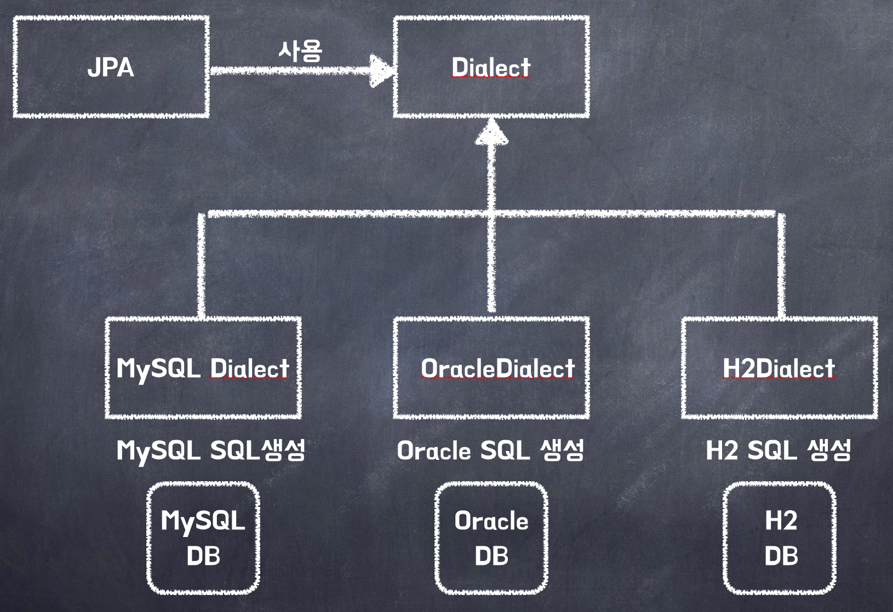

> - Spring이 데이터베이스와의 **통신을 객체 지향적**으로 처리할 수 있도록 도와주는 기술.
>
> - **JPA 자체는 interface의 집합**이며, Spring 환경에서는 **하이버네이트**(Hibernate)와 같은 JPA 구현체를 사용하여 동작.
>  - **JPA의 핵심 역할은 ORM**이다.
>
> - 데이터베이스 테이블이 아닌, 객체를 다루는 것에 집중함. = **객체 지향**
>
> - 데이터는 관계형 데이터베이스(RDB)에 테이블 형태로 저장됨.
>
> - JPA는 이 두 세계를 연결해주는 **번역기 역할**. 객체를 저장시 JPA가 알아서 SQL을 생성하여 데이터베이스에 실행함.

## 🎯 Spring JPA 사용 이유
---
- **생산성, 유지보수성, 객체 지향성**을 극대화하기 위해 사용.
### 1. 생산성 및 개발 속도 향상 (자동화)
- 개발자가 CRUD 작업을 위한 SQL을 작성할 필요가 줄어듬. JPA가 엔티티 객체의 변경 사항을 감지하여 **자동으로 필요한 SQL을 생성**하고 실행.
- **Repository **인터페이스를 정의하고 `JpaRepository`를 상속받기만 하면, **Spring**이 **자동으로 기보 CRUD 메서드를 구현**해줌.
### 2. 패러다임 불일치 해소 (객체 지향성 강화)
- 객체 지향과 프로그래밍과 관계형 데이터베이스의 다른 설계 방식(패러다임 불일치)을 JPA가 해결해줌.
### 3. 유지보수 및 이식성 증가
- SQL말고 코드를 통해 데이터베이스 작업을 관리하므로, **버그를 찾거나 기능을 수정하기 쉬움**.
- JPA는 추상화된 계층이기에 DB를 변경하기 비교적 용이함. (JDBC API대신 **JPA 표준에 의존**).
### 4. 성능 최적화 기능
- 같은 트랜잭션 내에서 동일한 객체를 조회할 경우, [**영속성 컨텍스트**](/2ac3b799429180919924e356ef749ec9?pvs=25#2ac3b79942918079a893fefc5a294486)의 **1차 캐시로 정보를 조회**함. → **DB**에 접근하지 않기에 **DB 트래픽 **📉
- 당장 필요하지 않은 연관된 데이터는 실제로 사용될 때까지 **로딩을 지연**시켜 불필요한 DB 조회 📉
