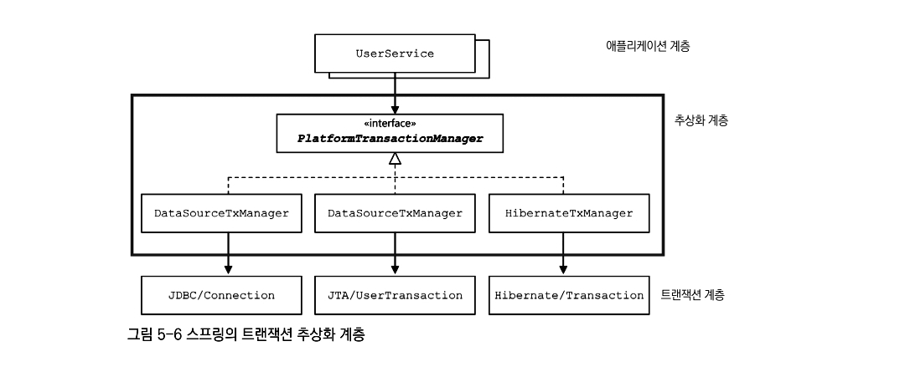

> - PSA는 이동 가능한 서비스 추상화라고 함. 외부 기술이나 환경의 변화와 관계없이 애플리케이션의 핵심 비즈니스 로직을 **일관된 방식으로 유지**할 수 있도록 돕는 **Spring **설계 원칙.

## 📚 PSA (Portable Service Abstraction) 개념
---
### 1. 추상화 구조 제공
- PSA는 기술을 사용하는 방식을 **표준화된 인터페이스(추상화 계층)로 제공**함.** 개발자는 이 인테페이스를 통해 기술에 접근**하여, 내부적으로 어떤 기술(library)이 사용되는지 알 필요없음. 
### 2. 일관된 접근
- 성격이 비슷한 여러 종류 기술을 추상화 → 기술이 변경되도 **동일한 인터페이스와 메서드 방식 유지** 가능.
### 3. 유연성 극대화
- 추상화 덕에, 코드를 크게 수정하지 않더라도 내부 구현 기술을 쉽게 교체할 수 있음. → **최소한의 변경**

## 💡Spring의 대표적인 PSA 예시
---
<table header-row="true" header-column="true">
<colgroup>
<col width="105.33332824707031">
<col width="204.3333282470703">
<col width="416.3333282470703">
</colgroup>
<tr>
<td>PSA 영역</td>
<td>추상화 인터페이스/어노테이션</td>
<td>구체적인 기술 예시 (구현체)</td>
</tr>
<tr>
<td>트랜잭션 관리</td>
<td>`@Transactional` </td>
<td>JTA, JDBC, JPA, Hibernate 등</td>
</tr>
<tr>
<td>캐시 관리</td>
<td>`@Cacheable`, `@CacheEvict`</td>
<td>EhCache, Redis Cache, Caffeine 등</td>
</tr>
<tr>
<td>데이터 접근</td>
<td>JdbcTemplate</td>
<td>Oracle JDBC, MySQL JDBC, PostgreSQL JDBC 등</td>
</tr>
<tr>
<td>웹 MVC</td>
<td>`@Controller`, `@GetMapping`</td>
<td>내부적으로 서블릿(Servlet) 기술 추상화</td>
</tr>
</table>
