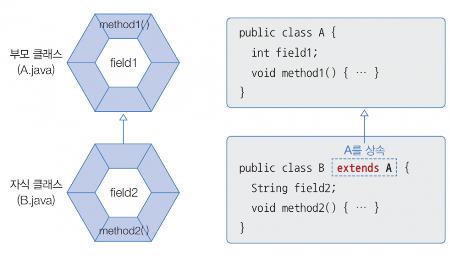

> - 기존에 정의된 클래스의 속성과 메서드를 새로운 클래스에서 **물려받아 사용**할 수 있는 매커니즘.
> **- **부모 클래스와 자식 클래스가 있고, 부모 클래스에게 자식 클래스가 기능을 물려받음.

<table header-row="true">
<colgroup>
<col width="178.3333282470703">
<col width="527.3333282470703">
</colgroup>
<tr>
<td>용어</td>
<td>설명</td>
</tr>
<tr>
<td>**부모 클래스(Parent Class)**</td>
<td>속성과 메서드를 물려주는 기존의 클래스.</td>
</tr>
<tr>
<td>**자식 클래스(Child Class)**</td>
<td>부모 클래스에게 속성과 메서드를 물려받는 클래스.</td>
</tr>
</table>

## 📚 핵심 용어
---
### 코드 재사용 (Code Reusability)
- 부모 클래스의 기능을 자식 클래스에서 **재사용**할 수 있기에 코드의 **중복성이 줄어든다**.
### 유지보수 용이성 (Maintainability)
- 공통적인 코드를 사용하는 것이기에** ****부모 클래스의 기능만을 수정**하면 됨.
### 확장성 (Extensibility)
- 자식 클래스에서 만들어야되는 **추가적 기능만을** 만들면 되기에 확장성이 좋아짐.
### 다형성 지원 (Support for Polymorphism)
- 상속을 통해 **다형성**을 구현할 수 있는 기반이 됨.
## ✨ 장점
---
### 새로운 속성 및 메서드 추가
- 부모에게 없는 자신만의 고유한 기능만을 만들면 됨. → 확장성 📈
### 메서드 재정의
- 부모 클래스에서 물려받은 메서드를 자식 클래스에 맞게 **기능을 수정**하여 덮어써 사용 가능.
- Spring boot에서 `@Override` annotation을 사용하여 메서드 재정의 가능.
