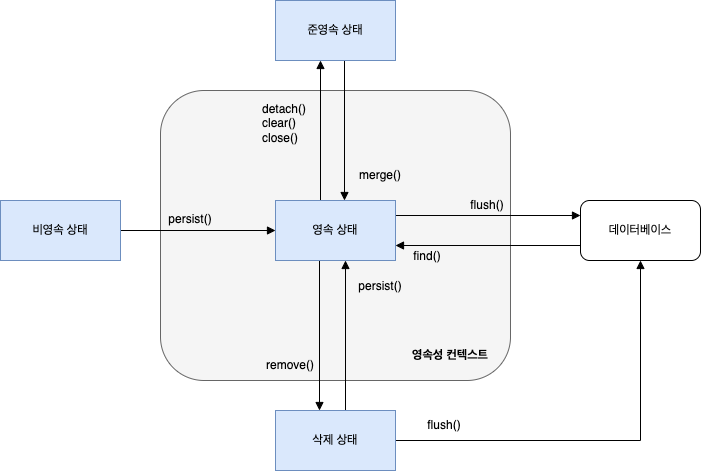

> - **APPLICATION**과 **DB **사이에 존재하는 논리적인 개념의 **캐시 또는 저장 공간.**** **엔티티 객체를 효율적으로 관리하고 **데이터 일관성과 성능**을 높임. 
> - `EntityManager`를 통해 접근하고, `EntityManager`와 같이 생성됨.** **

## 🔓영속성 컨텍스트의 핵심 역할
---
### 1차 캐시 (First-Level Cache)
- 영속성 컨테이너 내부에 엔티티를 저장하는 캐시 공간.
	- **동작 방식** : 특정 엔티티를 조회하면, 영속성 컨테이너의 **1차 캐시에 저장**됨.
	- **성능 이점** : 동일한 엔티티를 다시 조회시 **DB에 가지 않고 1차 캐시**에서 반환.
### 동일성 보장 (Identity)
- 항상 같은 객체 인스턴스를 반환하도록 보장.
### 트랜잭션 쓰기 지연 (Transactional Write-Behind)
- 데이터를 수정하거나 저장하는 작업을 바로 DB에 보내지 않고 **쌓아둠**. 
	- **작동 **: 엔티티의 변경 사항을 SQL **쿼리로 만들어 쌓아**둠.
	- `commit `시점: `@Transactional`이 종료되고 `commit `발생하는 시점에 모아둔** ****쿼리를 한 번에 DB에 전송**하여 성능을 최적화합니다.
### ❗변경 감지 (Dirty-Checking) - 중요
- 엔티티를 1차 캐시에 저장할 때, 최초 상태를 복사해둠.
- 트랜잭션이 `commit` 될 때, 현재 엔티티의 상태와 스냅샷을 비교하여 **변경된 부분을 자동**으로 DB에 반영.
## 📦엔티티의 4가지 상태
---
- **비영속 (New/Transient)** : 엔티티 객체를 생성했지만, **아직 영속성 컨텍스트와 DB에 저장되지 않은** 순수한 객체 상태.
- **영속 (Managed)** : 엔티티 매니저(`EntityManager.persist()`)를 통해 영속성 컨텍스트에 저장된 상태. 이 상태의 엔티티만 **Dirty Checking 및 관리를 받음.**
- **준영속 (Detached)** : 영속성 컨텍스트에서 분리된 상태. 분리되어 **JPA의 관리를 받지 않음**.
- **삭제 (Removed)** : 영속성 컨텍스트와 DB에서 삭제될 상태. **트랜잭션이 commit되면 DB에서도 삭제**됨.

