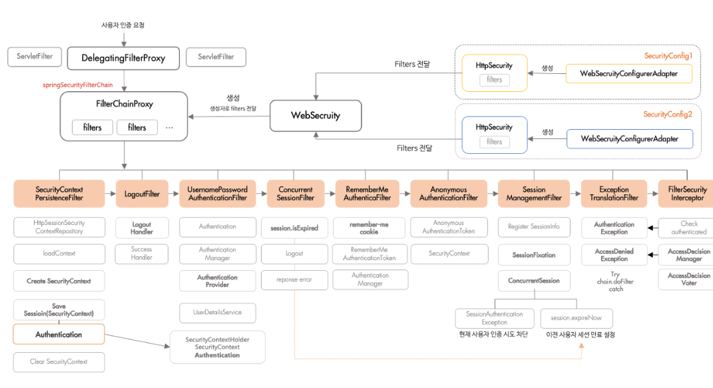

> - **인증, 인가, 데이터 보호, 입력 값 검증** 등의 일들을 하는 친구
>
> - **spring boot**의 경우 `Filter Chain`이라는 AOP를 사용하여 수많은 필터를 거치게 함.
## 🔓 인증 (Authentication) - “누구냐 넌”
---

> - 신분증 검사를 하는거라 생각하면 된다. → 사용자의 **신원이 실제와 맞는지** 확인
>
> > **주요 방식**
> 📄 [jwt token](https://app.notion.com/p/2c03b79942918068aa58fc357f6d1189)
> 📄 [session/cookie](https://app.notion.com/p/2c03b799429180df9ee5cc1efd1867ea)
> 📄 [OAuth](https://app.notion.com/p/2c03b799429180bca0bbcfca38fc525e)
## 🧾 인가 (Authorization) - “너 권한 있어?”
---
> - 인증된 사용자(인증 통과) 리소스에 **접근할 권한**이 있는지 확인하는 절차
> > **ex) **사원증이 있다고 해서 사장실에 들어갈 수 있는 건 아닌것과 같음.
## 🛡️ 데이터 보호 (Data Protection) - “훔치면 어떻게 할건데?”
---
> - 전송 중 암호화 (HTTPS/TLS) : 클라이언트와 서버 간 통신을 암호화.
> → 중간에서 데이터를 가로채도 내용을 알 수 없음.
>
> - 저장 시 암호화를 통해 비밀번호, 개인정보(ex : 주민번호, 전화번호 등)을 보지 못함.
## 🚫 입력 값 검증 (Input Validation) - “의심하라”
---

> - 클라이언트가 보낸 정보를 절대 신뢰하지 않고, 서버에 철저하게 검사함.
>
> > **ex**
> **SQL Injection 방지 **: 해커가 SQL문을 주입하여 **DB를 조작하는 공격 방지** 
> → **ORM(JPA), PreparedStatement**를 사용
> **XSS (Cross Site Scripting)** : 악성 스크립트를 심는 것을 막기 위해 HTML 태그를 필터**링**
> **유효성 검사 (****`@Valid`****)** : 비즈니스 로직에 맞는 데이터인지 검사.
## ⛓️Fillter Chain
---
```java
@EnableWebSecurity
@Configuration
@RequiredArgsConstructor
public class SecurityConfig {

    private final JwtAuthenticationEntryPoint jwtAuthenticationEntryPoint;
    private final JwtAccessDeniedHandler jwtAccessDeniedHandler;
    private final JwtAuthenticationFilter jwtAuthenticationFilter;

    @Bean
    public PasswordEncoder passwordEncoder() {
        return new BCryptPasswordEncoder();
    }


    @Bean
    public SecurityFilterChain securityFilterChain(HttpSecurity http) throws Exception {
        http
                .csrf(AbstractHttpConfigurer::disable) // csrf 공격 방지용

                .cors(cors -> {})

                .exceptionHandling(ex -> ex
                        .authenticationEntryPoint(jwtAuthenticationEntryPoint) // 401 발생 인증 실패
                        .accessDeniedHandler(jwtAccessDeniedHandler) // http 메서드가 잘못됬을때 405 발생
                )

                .headers(headers -> headers.frameOptions(HeadersConfigurer.FrameOptionsConfig::sameOrigin)) // iframe을 차단하는 것을 해제 -> 차단안할시 react에서 못씀(react에서 iframe을 사용하기 때문)
                .sessionManagement(session -> session.sessionCreationPolicy(SessionCreationPolicy.STATELESS)) // session이나 cookie를 만들지 않도록 차단

                .addFilterBefore(jwtAuthenticationFilter, UsernamePasswordAuthenticationFilter.class)

                .authorizeHttpRequests(auth -> auth
                        .requestMatchers(HttpMethod.OPTIONS, "/**").permitAll()
                        .requestMatchers("/api/auth/signup", "/api/auth/login", "/api/email/send", "/api/email/verify", "/api/auth/find-id/**", "/api/auth/find-password/**", "/error").permitAll()
                        .requestMatchers("/main/search/index").hasRole("ADMIN")
                        .requestMatchers("/api/manage/**", "/manage/**").hasAnyRole("MANAGER", "ADMIN")
                        .requestMatchers("/mypage/**").hasAnyRole("USER", "MANAGER",  "ADMIN")
                        .anyRequest().hasAnyRole("USER", "MANAGER", "ADMIN")
                )
                .logout(AbstractHttpConfigurer::disable
                );

        return http.build();
    }
}

```

> - filter chain을 통해 인증, 인가, 세션 관리, CORS, CSRF 등 보완과 관련된 필터들을 체인처럼 엮음.
> > **ex**
> Http 요청 → Web Applicaiton Server(Servlet Container) → 필터1 → 필터2 …
> → Servlet → Controller
## 🌐 WebMvcConfigurer
---
```java
@Configuration
public class WebMvcFilter implements WebMvcConfigurer {

    @Override
    public void addCorsMappings(CorsRegistry registry) {
        registry.addMapping("/**") // 모든 api 요청에 cors 규칙을 적용하겠다는 뜻
                .allowedOrigins("http://localhost:8080", "http://localhost:9200", "http://localhost:5173")
                .allowedMethods("GET", "POST", "PUT", "DELETE", "PATCH", "OPTIONS")
                .allowedHeaders("Authorization", "Cache-Control", "Content-Type")
                .allowCredentials(true) // JWT 인증 시 필수 Authorization 헤더가 (JWT)를 포함하거나 쿠키를 주고받을 수 있도록 허용, *로 하면 Authorization 자동으로 인식안함.

                // Preflight 요청 결과(OPTIONS 메서드를 통한 사전 통신)를 3600초(1시간) 동안 캐시하여, 매 요청마다 Preflight 통신을 하는 오버헤드를 줄임.
                // PUT, DELETE 요청이나 JWT를 포함하는 모든 요청 (대부분 Authorization 헤더를 사용하므로) Preflight 요청을 발생시킴
                .maxAge(3600);
    }
}

```
> - cors 설정하는 부분
> - 접근 권한 설정
