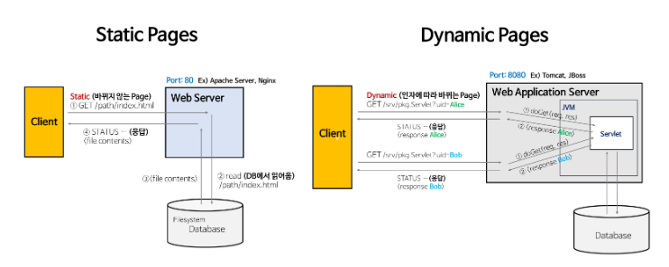
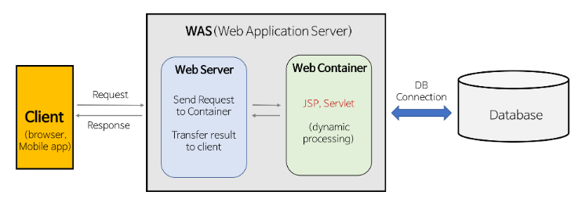

# Static Pages & Dynamic Pages

<callout color="gray_bg">
	> **Static Pages**
		- Web Server는 파일 경로 이름을 받아 경로와 일치하는 file contents를 반환
		- 항상 동일한 페이지를 반환
		- ex) image, html, css, javascript 파일과 같이 컴퓨터에 저장되어 있는 파일들
	> **Dynamic Pages**
		- 인자의 내용에 맞게 동적인 contents를 반환
		- 웹 서버에 의해 실행되는 프로그램을 통해서 만들어진 결과물 Servlet: WAS 위에서 돌아가는 Java Program
		- 개발자는 Servlet에 doGet()을 구현
</callout>
# Web Server와 WAS의 차이

<callout color="gray_bg">
	> **Web Server**
		**개념: **소프트웨어와 하드웨어로 구분된다.
		- **하드웨어**: Web 서버가 설치되어 있는 컴퓨터
		- **소프트웨어**: 웹 브라우저 클라이언트로부터 HTTP 요청을 받아 **정적인 컨텐츠**를 제공하는 컴퓨터 프로그램
		**기능**: HTTP 프로토콜을 기반으로 하여 클라이언트의 요청을 서비스 하는 기능을 담당
		- 정적인 컨텐츠 제공, WAS를 거치지 않고 바로 자원을 제공
		- 동적인 컨텐츠 제공을 위한 요청 전달을 위해 클라이언트의 요청을 WAS에 보내고, WAS가 처리한 결과를 클라이언트에게 전달
		**Web Server ex)** `Apach Server`, `Nginx`, `IIS` 
	> **WAS (Web Application Server)**
		**개념**: DB 조회나 다양한 로직 처리를 요구하는 동적인 컨텐츠를 제공하기 위해 만들어진 Application Server. 즉, HTTP를 통해 컴퓨터나 장치에 애플리케이션을 수행하는 미들웨어이다. (`Web Container` or `Servlet Container`라고 한다.)
		역할: WAS = Web Server + Web Container 
		- Web Server 기능들을 구조적으로 분리하여 처리하고자하는 목적으로 제시됨.
			- 분산 트랜잭션, 보안, 메시징, 쓰레드 처리 등의 기능을 처리하는 분산 환경에서 사용
			- 주로 DB 서버와 같이 수행
		- 현재는 WAS가 가지고 있는 Web Server도 정적인 컨텐츠를 처리하는 데 있어서 성능상 큰 차이가 없다.
</callout>
# Web Server와 WAS를 구분하는 이유
<callout color="gray_bg">
	### Web Server가 필요한 이유
	클라이언트에 이미지 파일(정적 컨텐츠)을 보내는 경우 정적 파일들은 **HTML 문서**가 클라이언트로 보내질 때 함께 가는 것이 아닌 HTML 문서를 먼저 클라이언트가 받고, 그에 맞게 필요한 이미지 파일들을 다시 서버로 요청해서 이미지 파일을 받아오는데, 이때 **Web Server를** 통해 정적인 파일들을 **Application Server**까지 가지 않고 앞단에서 빠르게 보내줄 수 있다. → **Web Server**에서는 정적 컨텐츠만 처리하도록 기능을 분배하여 서버의 부담을 줄일 수 있다.
	### WAS가 필요한 이유
	웹 페이지는 정적 컨텐츠와 동적 컨텐츠가 모두 존재. → WAS를 통해 요청에 맞는 데이터를 DB에서 가져와서 비즈니스 로직에 맞게 그때 그때 결과를 만들어서 제공함으로써 자원을 효율적으로 사용.
	> **그럼 WAS가 Web Server의 기능도 하면 되는거 아님? — ㄴㄴ 아님**
		- WAS는 DB 조회나 다양한 로직을 처리하느라 바쁘기에, 단순한 정적 컨텐츠는 Web Server에서 빠르게 제공하는게 좋다. - 만약 WAS가 정적 컨텐츠까지 처리하면 수행 속도가 느려진다.
		- 물리적인 분리로 인한 보안 강화를 위해 SSL에 대한 암복호화 처리에 Web Server를 사용
		- 여러 대의 WAS 연결 시 Load Balancing을 위해 Web Server를 사용. 특히 대용량 웹 어플리케이션의 경우 Web Server와 WAS의 분리로 무중단 운영에 용이하다.
		- 접근 허용 IP 관리, 2대 이상의 서버에서의 세션 관리 등도 Web Server에서 처리하면 효율적이다.
		- **fail over**(작동 중지된 WAS 대신 다른 WAS 사용), **fail back**(작동 중지된 WAS를 재동작시킴)
</callout>
