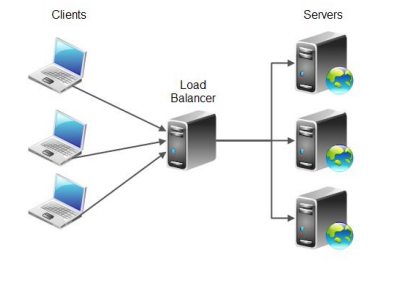
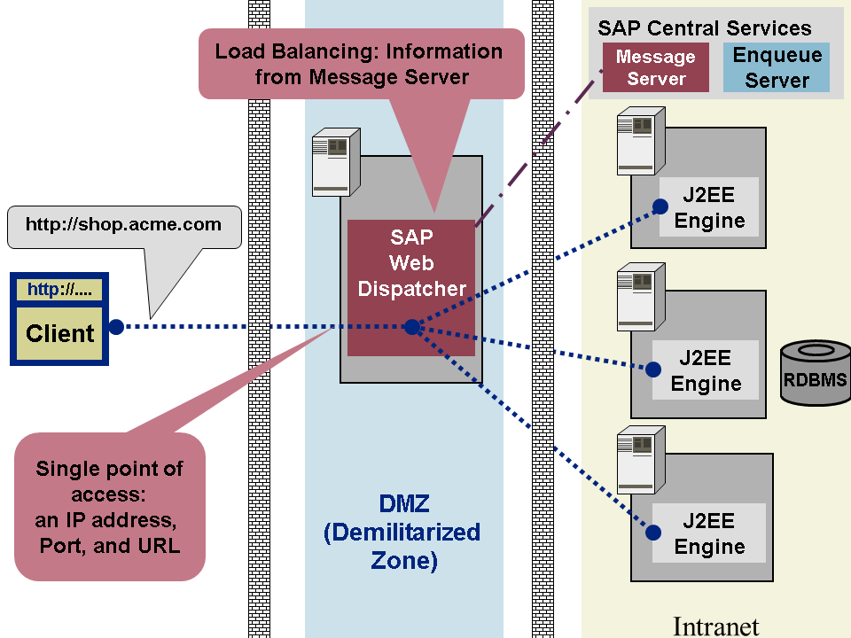

# 로드 밸런싱이란?
<callout color="gray_bg">
	분산 컴퓨팅에서 사용되는 미들웨어 아키텍처로 서버 팜을 클라이언트에게 단일 서버처럼 보이게 해준다. → 높은 확장 가능성과 고가용성 가능
</callout>

> **Load Balancer가 왜 나왔냐?**
	모든 요청을 처리하는 단일 서버는 높은 트래픽 양을 처리하기에 용량이 부족할 수 있음
	**해결책**
	- **스케일업**: 단기적인 해결책에 불과하고 서버 성능 향상에 비해 비용이 불균형적으로 높다
	- **MSA 사용**: 저렴한 하드웨어와 운영체제를 기반으로 한 서버 팜의 여러 인스턴스로 처리
## 로드 밸런서(디스패처) 아키텍처
<callout color="gray_bg">
	> **구조**
		들어오는 요청은 클라언트에게 투명한 전용 서버 로드 밸런서로 전달
		가용성 또는 혀냊 서버 부하와 같은 매개변수를 기반으로 로드 밸런서는 어떤 서버가 해당 요청을 처리해야 하는지를 결정 후 선택된 서버로 요청을 전달
		로드 밸런싱 알고리즘이 필요한 입력 데이터를 제공하기 위해 로드 밸런서는 서버의 상태 및 부하 정보를 검색하여 트래픽에 응답할 수 있는지 확인
</callout>
<empty-block/>
## **Availability vs Scalability **(가용성과 확장성)
<callout color="gray_bg">
	>
		**Availability: **장애가 발생한 시간부터 다시 정상적으로 작동하기까지의 시간 (업타임)
		업타임 기간 동안 시스템은 미리 정의된 명확한 시간 내에 각 요청에 응답해야함.
		고가용성은 기본적으로 시스템 내에서의 중복성이다. 하나의 서버가 실패하는 경우 다른 서버가 해당 서버의 작업 부하를 이어받는데 이는 클라이언트에게 보이지 않는다.
		높은 가용성을 달성하기 위해서는 로드 밸런서가 서버를 모니터링하여 과부하나 다운된 서버로 요청을 보내지 않아야 하고, 로드 밸런서 자체도 중복이 되어야 한다.
	> **Scalability: **확장성은 시스템이 단일 클라이언트 뿐만 아니라 수천개의 동시 클라이언트를 서비스할 수 있는 능력을 의미
		→ 고 확장성은 서버로 들어오는 요청을 서버들 사이에 분산함으로써 달성할 수 있다.
</callout>
## 로드 밸런서 아키텍처
<callout color="gray_bg">
	> **구현**
		서버 로드 밸런싱 솔루션은 두 가지 유형으로 나눌 수 있다.
		#### **전송 로드 밸런싱(Transport-level)**
		DNS 기반 접근 방식 또는 TCP/IP 수준 로드 밸런싱과 같이 응용 프로그램과 독립적으로 동작
		#### 응용프로그램 로드 밸런싱(Application-level)
		응용 프로그램 페이로드를 사용하여 로드 밸런싱 결정
	로드 밸런싱 솔루션은 소프트웨어와 하드웨어 기반 로드 밸런서로 더 구체적으로 분류 가능
	**하드웨어 기반**: 특정 용도를 위한 커스터마이즈된 응용 프로그램 특화 통합 회로를 포함, 주로 **transport 레벨**의 로드 밸런싱을 위해 사용. 속도 👍🏻 \| 비용 👎🏻
	**소프트웨어 기반**: 표준 운영 체제 및 개인용 컴퓨터에서 실행. 주로 전용 로드 밸런서 하드웨어 노드 내에서 실행하거나 응용 프로그램 내에서 직접 실행.
</callout>
<empty-block/>
## 로드 밸런서 아키텍처 예시
<callout color="gray_bg">
	>
		**DNS 기반 로드 밸런싱**
		하나의 호스트 이름에 여러개의 IP 주소를 할당할 수 있는 DNS의 특성을 기반
		DNS는 각기 다른 위치에 있는 여러 데이터 센터 간에 로드를 분산해야 하는 전역 서버 로드 밸런싱에 효율적
		전용 데이터 센터 내에서 로드를 분산하기 위한 다른 서버 로드 밸런싱 솔루션과 결합
	> **TCP/IP 서버 로드 밸런싱**
		낮은 수준의 레이어 스위칭에서 작동
		Linux Virtual Server(LVS)가 있음
</callout>

<callout color="gray_bg">
	낮은 수준의 서버 로드 밸런서 솔루션인 LVS와 같은 솔루션은 응용 프로그램의 상황에 따라 한계에 도달할 수 있음.
	캐싱은 동일한 데이터를 반복적으로 가져오는 비용을 피하기위해 중요한 확장성 원칙이다.
	캐시는 이전 데이터 검색 작업에서 발생한 중복 데이터를 일시적으로 보유하는 저장소
	서버 측에서 캐시를 사용하는 경우 캐시로 인한 잘못된 요청 문제가 발생할 수 있음. → 캐시를 전역 공간에 배치하여 해결
	memcached는 여러 대의 컴퓨터에 걸쳐 큰 캐시를 제공하는 분산 캐시 솔루
</callout>
