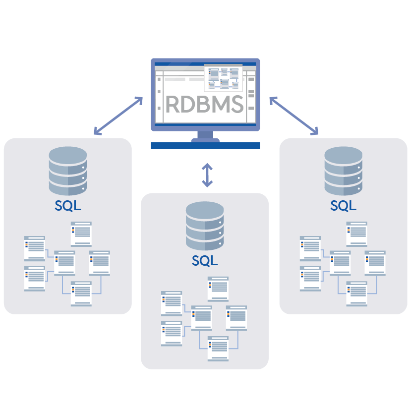

<callout color="gray_bg">
	- 데이터를 **Table **형태로 저장하고, 이 **Table **사이의 **관계를 정의**하여 관리. 
	<empty-block/>
	- 여전히 메인 데이터 저장소는 **RDBMS**이다. → **관계와 신뢰가 비즈니스 로직의 핵심**이기 떄문
	**ex)** **MySQL, Oracle, PostgreSQL**
	<empty-block/>
	- **SQL**이라는 언어를 통해서 데이터를 찾고 접근하며, 데이터를 최적의 방법으로 찾아옴.
	<empty-block/>
	> **사용이유**
		**RDBMS**는 **ACID**라는 4가지 성질을 통해 **데이터가 꺠지거나 모순이 생기는 것을 막음**
		<empty-block/>
		- **A (Atomicity, 원자성)** : 둘 중 하나의 상태 밖에 없음 **“전부 하거나, 전부 안 하거나”**.
		→ 송금 도중 에러 나면 돈이 증발하는 게 아니라 **원래대로 rollback됨**.
		- **C** (**Consistency**, **일관성**) : 미리 정해둔 규칙(ex: 잔고는 마이너스가 될 수 없다)을 위반 못함.
		- **I** (**Isolation, 격리성**) : 여러 명이 **동시에 수정**해도 순서대로 처리된 것처럼 **꼬이지 않게 함**.
		- **D** (**Durability, 지속성**) : 저장이 완료됐다면, 서버 전원이 뽑혀도 **데이터는 안 날아감**.
		<empty-block/>
		✨ 즉, “돈, 결제, 개인정보” 처럼 절대 **틀리면 안 되는 데이터를 다룰 때 RDBMS는 필수**.
</callout>

## ⭐장점
---
<callout color="gray_bg">
	**- 데이터의 무결성 보장** : **중복 데이터를 최소화**하고, 외래키 제약 조건을 걸음.
	→ 없는 회원 데이터와 연관된 데이터를 가질 수 없도록함. 즉, **유령 데이터가 생기지 않게함**.
	<empty-block/>
	**- 데이터 조회** : 복잡하게 얽힌 데이터를 **JOIN 한 번**으로 가져올 수 있음. 
	→ 데이터 간의 **관계도를 파악하는데 있어서 최적화**되어 있음.
	<empty-block/>
	- **일관된 데이터 상태 유지** : **트랜잭션** 처리 능력이 좋아, 시스템 장애 발생 후에도 **데이터가 안 꼬임**
</callout>
## ⚠️ 단점
---
<callout icon="📌" color="gray_bg">
	**- 확장성의 한계** : **RDBMS**는 여러 서버로 **데이터를 쪼개는 것이 구조적으로 매우 힘듬**.
	→ So, 비싼 장비로 교체하는 것이 편하지만, 비용이 기하급수적으로 높아짐.
	<empty-block/>
	**- 유연성 부족** : 한번 테이블 구조를 정하면 **바꾸기가 매우 힘듬**. 
	→ **하나의 컬럼을 추가 시 모든 데이터**를 건드려야 되기에, **서비스에서 장애가 발생**할 수 있음
</callout>
<empty-block/>
