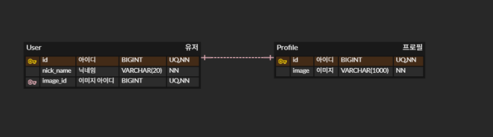
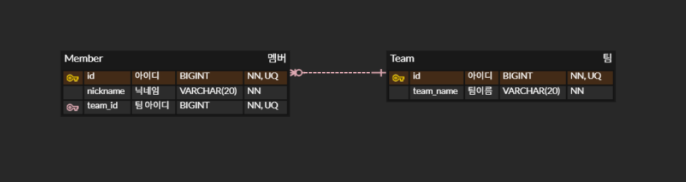
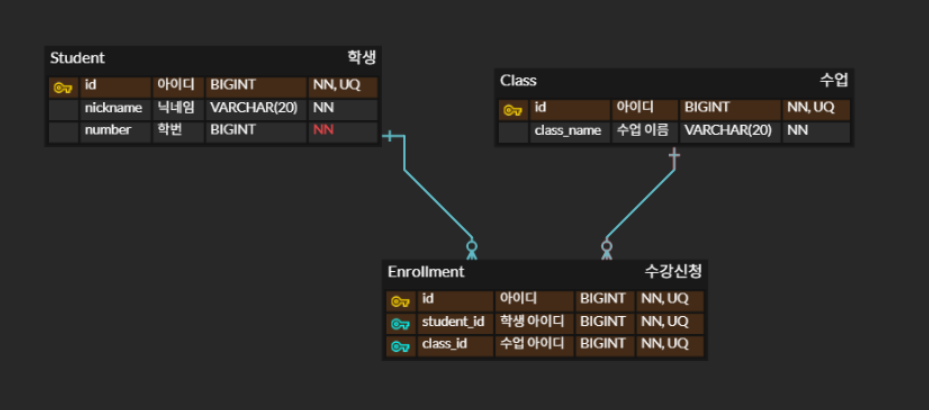

<callout icon="✨">
	**RDBMS를 사용할 때 모르면 절대 안되는 개념**
</callout>
<empty-block/>
<callout color="gray_bg">
	- **외래키(Foreign-Key)**로 **테이블을 연결**하는 것을 의미. 가장 **대표적인 것으로는 3가지**가 있다.
	→ **1:1(One-to-One)**, **1:N(One-to-Many)**, **N:M(Many-to-Many)**
	<empty-block/>
	- **RDBMS**는 **Table**을 **연결하거나 정의할 때 Key라는 것**을 통해 수행함. → **무결성 유지** 🛡️
	<page url="https://app.notion.com/p/2cd3b799429180b9abc5df5b2d82ecb5">RDBMS의 Key의 정의와 종류 </page>
	<empty-block/>
	**데이터 중복을 없애고**, 데이터가 있어야 할 위치를 찾아 **정리하는 것**이다.
	<page url="https://app.notion.com/p/2cd3b7994291805599b1f53d45485e6c">정규화</page>
</callout>
<empty-block/>
## 1:1 (One-to-One) 관계
---

<callout color="gray_bg">
	- 보통 주로 조회하는 **테이블에 FK를 연결**해놓음
	<empty-block/>
	> **ex**
		**User - Profile** (한 명은 하나의 프로필만 가짐)
		**User Table**에 `profile_id` (**FK, Unique**)를 둠.
		**Unique** 제약조건을 추가하지 않을 시 **1:N이 되어버림.**
</callout>
<empty-block/>
## 1:N (One-to-Many) 관계 ⭐
---

<callout color="gray_bg">
	- 무조건 **N 쪽이 FK를 가짐**. 
	<empty-block/>
	> **ex **
		**Team **- **Member **(팀 하나에 팀원 여러명)
		**Member Table**에 `team_id` (**FK**)가 존재해야함.
		T**eam Table**에 `member_id`를 넣으면 `[1, 2, 3]` **리스트 형태**로 적재해야함 
		→ **RDBMS는 리스트 저장 불가** ❌
</callout>
## N:M (Many-to-Many) 관계
---

<callout color="gray_bg">
	- **RDBMS는 N:M을 직접 표현할 수 없음**. 
	<empty-block/>
	- **N:M**을 구현할 때 **1:N, N:1**로 중간 테이블에 연결해서 **중간 테이블을 통해 N:M을 구현**함.
	<empty-block/>
	> **ex**
		**Student **- **Class** (학생도 여러 수업을 듣고, 수업도 여러 학생을 받음)
		수강신청 **Table**을 만들고, 여기에 `student_id`, `class_id`를 **FK**로 넣음 = **중간 테이블 사용**
</callout>
