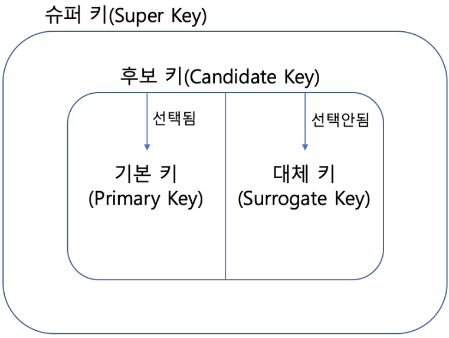
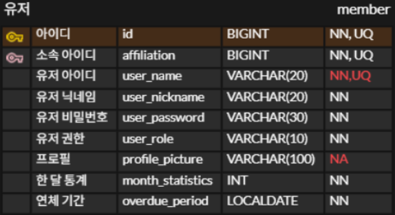
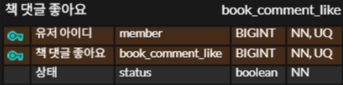
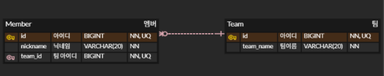

<callout color="gray_bg">
	- **Key**라는 것은 **RDBMS**에서 **Table**의 **연결과 제약조건을 정의**하는데 사용된다.
	<empty-block/>
	- **Key**를 통해 **Table** 정보를 식별할 수도 있다. → **Key**를 통해 인덱스를 만들어 사용할 수 있다
	<empty-block/>
	> **Key의 종류**
		<empty-block/>
		**개념적 키 **
		---
		**슈퍼 키(Super Key)** : **유일성**을 만족하는 키. **ex **: \{ 학번 \}, \{ 학번 + 주민등록번호 \}
		**복합 키(Composite Key)** : **2개 이상의 속성**을 `PK`로 사용하는 키.
		**후보 키(Candidate Key)** : **유일성**과 **최소성**을 만족하는 키. **PK가 되지 못해도 언제든 될 수 있음**.
		<empty-block/>
		**물리적 키**
		---
		**기본 키(Primary Key)** : **후보 키에서 선택**된 키. **NULL 값이 들어올 수 없다**.
		**대체 키(Surrogate Key)** : 후보 키 중에서 **기본 키로 선택되지 않은 키**.
		**외래 키(Foreign Key)** : 테이블 간의 `PK`를 참조하는 속성이다. **ex** : **Chat** 테이블에서 `User ID`를 참조하여 사용하는 것이다.
</callout>

<empty-block/>
## Super Key
---

<callout color="gray_bg">
	- 여기 유저 테이블을 예시로 들어보자면 아이디는 아이디라는 속성 하나만으로도 유일성이 있기 때문에 슈퍼 키이고, 프로필 정보는 이 속성 하나만으로 유일성이 없기에 프로필 정보 + 유저 닉네임 + 비밀번호 를 하면 이건 슈퍼 키가 될 수 있다.
	<empty-block/>
	- 즉, 슈퍼키는 **유일성을 가질 수 있는 속성으로만 구성**하면 된다.
</callout>
<empty-block/>
## Composite Key
---

<callout color="gray_bg">
	- 이 테이블 같이 **두 개 이상의 속성**을 합쳐 `PK`로 사용하는 것을 말한다.
	 - 중간 테이블이 다른 두 테이블에 대해 **의존도가 많이 높을 시 사용**한다. 즉, 이 테이블의 `PK`는 다른 두 테이블의 `PK`를 합쳐 사용하는 것으로 **관리를 더욱 쉽게** 할 수 있게 해준다.
</callout>
<empty-block/>
## Candidate Key
---

<callout color="gray_bg">
	- 단 하나만의 속성으로 **최소성**을 가질 수 있어야지 후보키가 될 수 있다.
	<empty-block/>
	- [위 테이블](/2cd3b799429180b9abc5df5b2d82ecb5?pvs=25#2d03b7994291806dbc6ac12031896e25)에서는 `id`, `user_name`이 후보키가 될 수 있다.
</callout>
<empty-block/>
## Primary Key
---
<callout color="gray_bg">
	- 후보키들 중에서 하나를 선택한 키로 **최소성**과 **유일성을 만족**하는 속성.
	<empty-block/>
	- 테이블에서 기본키는 **오직 1개만 지정**할 수 있다.
	<empty-block/>
	- 기본키는 **NULL 값을 절대 가질 수 없고,** **중복된 값을 가질 수 없다** = **유일성**
</callout>
<empty-block/>
## Alternate Key
---
<callout color="gray_bg">
	- 후보키가 두개 이상일 경우 어느 하나를 **기본키로 지정하고 남은 후보키**들 = **대체키**
	<empty-block/>
	- [위 테이블](/2cd3b799429180b9abc5df5b2d82ecb5?pvs=25#2d03b7994291806dbc6ac12031896e25)을 예시로 들면 `id`, `user_name` 이 후보키라면 그중 `id`를 `PK`로 사용하면 `user_name`이 대체키가 된다.
	<empty-block/>
	- **기본키가 없어지게 되면 대체키로 대체**할 수 있다.
</callout>
<empty-block/>
## Foreign Key
---

<callout color="gray_bg">
	**- Member** 테이블에서 `Team id`를 참조하기에 **Team** 테이블이 부모 테이블이다.
	<empty-block/>
	**- **자식 테이블에서 참조되는 `FK` 는 부모 테이블에서 `PK` 여야 된다.
	**→ **외래키는 참조되는 테이블의 **기본키와 동일한 키 속성**을 가짐.
	<empty-block/>
	**- **참조되는 **부모테이블이 먼저 생성**된 뒤, 참조하는 자식 테이블이 다음에 생김.
	<empty-block/>
	**- **부모 테이블을 삭제하려면 **자식 테이블을 먼저 삭제**한 뒤 삭제해야된다.
	→ 부모 테이블을 먼저 삭제할 시 자식 테이블에서 `FK`** 오류가 발생**할 수 있기 떄문
</callout>
