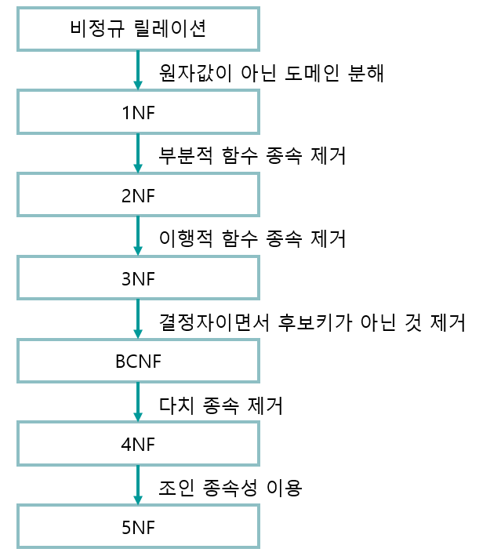

> - **데이터의 중복**을 없애고, **데이터가 존재해야할 정확한 위치**를 찾아주는 정리정돈이다.
>
> - 보통 **제3정규화까지 진행하면 잘 설계된 DB**가 나오기에 3단계까지만 다룬다.
>
> - **이상현상**을 해결하기 위해서도 정규화를 한다.
> 📄 [이상현상](정규화/이상현상.md)

## 제 1정규화  (1NF) - 모든 값은 하나여야 한다. (원자성)
---
> **- ****하나의 행(Column)당 값은 단 하나**만을 가져야한다. → **RDBMS**에서 **N:M**이 바로 안되는 이유
>
> > **ex**
> **취미 컬럼** : 축구, 농구, 야구

## 제 2정규화 (2NF) - 부분 종속 제거 (복합키 사용 시 적용)
---

<table header-row="true">
<tr>
<td>**학번 (PK)**</td>
<td>**과목코드 (PK)**</td>
<td>**성적**</td>
<td>**과목명**</td>
<td>**담당교수**</td>
<td>**수강료**</td>
</tr>
<tr>
<td>**101**</td>
<td>**CS01**</td>
<td>A</td>
<td>자료구조</td>
<td>김철수</td>
<td>50,000</td>
</tr>
<tr>
<td>**101**</td>
<td>**CS02**</td>
<td>B</td>
<td>알고리즘</td>
<td>이영희</td>
<td>50,000</td>
</tr>
<tr>
<td>**102**</td>
<td>**CS01**</td>
<td>A</td>
<td>자료구조</td>
<td>김철수</td>
<td>50,000</td>
</tr>
<tr>
<td>**103**</td>
<td>**CS03**</td>
<td>C</td>
<td>데이터베이스</td>
<td>박민수</td>
<td>60,000</td>
</tr>
</table>
> - 위 **Table Column**을 보면 담당교수 **Column**은 **과목코드 정보만 있으면 얻을 수 있는 정보**이다.
> → 그렇기에 **학번이라는 PK가 필요없는 담당교수가 이 테이블에 있는 설계는 잘못된 것**이다.
>
> **-** 이렇게 설계가 될 시 ⚠️**중복된 데이터가 수백개가 넘게** 생길 수 있는 문제가 발생할 수 있다.
> → 같은 데이터가 이렇게 많이 생기면 **같은 데이터를 몇백번 수정**해야되는 문제가 발생하게 된다. 

<table header-row="true">
<colgroup>
<col width="85">
<col width="129">
<col width="50">
</colgroup>
<tr>
<td>**학번 (PK)**</td>
<td>**과목코드 (PK, FK)**</td>
<td>**성적**</td>
</tr>
<tr>
<td>101</td>
<td>CS01</td>
<td>A</td>
</tr>
<tr>
<td>101</td>
<td>CS02</td>
<td>B</td>
</tr>
<tr>
<td>102</td>
<td>CS01</td>
<td>A</td>
</tr>
<tr>
<td>103</td>
<td>CS03</td>
<td>C</td>
</tr>
</table>

---

<table header-row="true">
<colgroup>
<col width="102">
<col width="100">
<col width="72">
<col width="73">
</colgroup>
<tr>
<td>**과목코드 (PK)**</td>
<td>**과목명**</td>
<td>**담당교수**</td>
<td>**수강료**</td>
</tr>
<tr>
<td>CS01</td>
<td>자료구조</td>
<td>김철수</td>
<td>50,000</td>
</tr>
<tr>
<td>CS02</td>
<td>알고리즘</td>
<td>이영희</td>
<td>50,000</td>
</tr>
<tr>
<td>CS03</td>
<td>데이터베이스</td>
<td>박민수</td>
<td>60,000</td>
</tr>
</table>
> - 이런식으로 테이블을 나눠서 중간 **Table**을 사용해 **N:M**을 만들어 사용하면 문제가 해결된다.
>
> - 즉, `PK`가 여러개일 경우 **전체 ****`PK`****에 의존하는 것이 아니면**, **Table**을 분리하는 것이 맞다.

## 제 3정규화 (3NF) - 이행 종속 제거
---
> - PK가 아닌 일반 컬럼에 의존하는 경우를 제거하는 정규화
>
> > **ex : 주문(Order) Table에 \[주문번호, 고객ID, 고객주소\]**
> **- 주문번호를 알면 고객 ID**를 알 수 있음 ✅
> **- 고객ID를 알면 고객주소**를 알 수 있음 ✅
> **- **하지만 **주문번호가 고객주소를 직접 결정하는 건 아님. ****주소는 고객한테 있는 정보이기 때문.**
>
> **- **⚠️ 고객이 이사를 가서 주소를 바꾸면, 그 고객의 **주문 데이터를 전부 찾아 수정**해야됨.
> = **DB 부담 및 트레픽 증가**

## ✨추천하는 사항
---
> **- **제 3정규화 다음 정규화를 공부해보는 것도 나쁘지 않을 수도 있다.
> **- Reason** : 현재는 엄청 복잡하지 않은 DB 구조를 형성하기에 괜찮지만 **DB가 점점 커질수록 중요**
