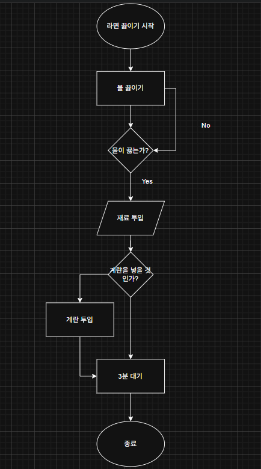

> > **다이어그램 잘 그리는 꿀팁**
> - 흐름도는 위에서 아래, 혹은 왼쪽에서 오른쪽. 역주행하는 화살표를 제외하고는 **흐름을 거스르면 안됨**.
>
> - **화살표끼리 십자(+)로 ****겹치는 것은 최대한 피해야**됨. 겹칠 때는 **bridge**를 써서 구분해줌.
>
> - 텍스트는 **최대한 간결**하게 작성하는 것이 좋음. **ex : ‘사용자가 비밀번를 입력함’** 말고 ‘**비밀번호 작성**’ 이런식으로 작성해주는게 좋음.

## 다이어그램 작성법
---
<table header-row="true" header-column="true">
<colgroup>
<col color="yellow" width="127.0250015258789">
<col width="92">
<col>
<col>
</colgroup>
<tr color="gray_bg">
<td color="gray_bg">**도형 모양**</td>
<td>**이름**</td>
<td>**언제 사용하나?**</td>
<td>**누구랑 같이 쓰나?**</td>
</tr>
<tr>
<td>**타원 / 둥근 사각형**</td>
<td>**시작/종료** (Terminal)</td>
<td>**프로세스의 맨 처음과 끝**을 알릴 때 사용 ex : 앱 실행, 로그인 완료</td>
<td>• **시작:** 나가는 화살표만 있음 • **종료:** 들어오는 화살표만 있음</td>
</tr>
<tr>
<td>**직사각형**</td>
<td>**처리/작업** (Process)</td>
<td>**실제로 하는 행동이나 연산**을 적습니다. 가장 많이 쓰이는 블록. 예) 비밀번호 입력, 장바구니 담기</td>
<td>• 앞뒤로 다른 처리(직사각형)나 판단(마름모)이 연결됨.</td>
</tr>
<tr>
<td>**마름모**</td>
<td>**판단/조건** (Decision)</td>
<td>**Yes/No로 갈림길이 생길 때** 사용. 반드시 질문 형태가 들어갑니다. 예) '회원인가?', '재고가 있는가?'</td>
<td>• **반드시 2개 이상의 화살표**가 나감. (보통 Yes와 No로 나뉨)</td>
</tr>
<tr>
<td>**평행사변형**</td>
<td>**입력/출력** (I/O)</td>
<td>**데이터가 들어오거나 나갈 때** 사용. 사용자가 값을 넣거나, 화면에 결과가 뜰 때. 예) '아이디 입력받기', '오류 메시지 출력'</td>
<td>• 처리(직사각형) 전후에 배치되어 데이터를 주고받음</td>
</tr>
<tr>
<td>**화살표**</td>
<td>**흐름선** (Flowline)</td>
<td>작업의 순서(방향)를 나타냄.</td>
<td>• 모든 도형을 이어줍니다. • 흐름은 보통 **'위→아래'**, ’왼쪽→오른쪽'이 원칙.</td>
</tr>
</table>

## ⭐추가로 공부하기
---
[\[UML\] 다이어그램 작성법](https://velog.io/@jungmyeong96/UML-%EB%8B%A4%EC%9D%B4%EC%96%B4%EA%B7%B8%EB%9E%A8-%EC%9E%91%EC%84%B1%EB%B2%95)
